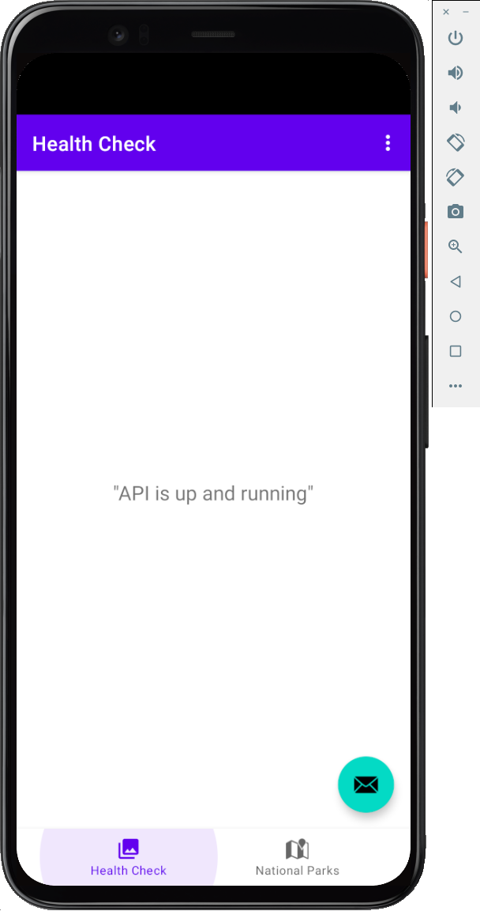
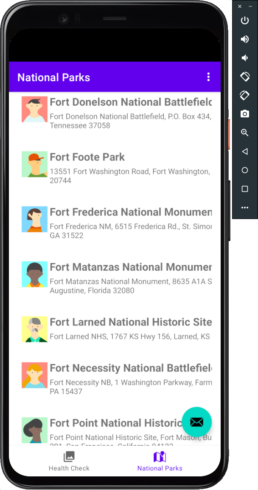

# National Parks - Android

## Setup

1. A "Global" `gradle.properties` file is needed to supply the necessary configuration items needed to build the Android application.  This file is typically located in the user's HOME directory under a directory named `.gradle`.  Start by creating this directory if it doesn't exist:
   
   ```bash
   $ mkdir $HOME/.gradle
   ```

2. Create the `.gradle/gradle.properties` file with the following content:
  
   ```bash
   RUM_ACCESS_TOKEN=<token>
   RUM_REALM=<realm>
   REST_BACKEND=<backend_url>
   ```

   where:

    * `<token>` should be replaced with a __RUM__ token from your Splunk Observability account.  See [https://app.<SPLUNK_REALM>.signalfx.com/#/organization/current?selectedKeyValue=sf_section:accesstokens]() for available tokens.
    * `<realm>` is the realm your Splunk Observability account is available in. (e.g., `us0`, `us1`, `eu0`, etc.)
    * `<backend_url>` is the URL to the National Parks REST backend in the format **http(s)://(hostname|ip address):(port)**. Example: `http://192.168.3.233`.

3. To set up this project, first clone the repository

    ```bash
    $ git clone https://github.com/billmeyer/nationalparks-android.git
    ```

4. Build the project into an APK file.

   ```bash
   $ cd nationalparks-android
   $ ./gradlew assemble
   ```

## Run

1. Open the project in **Android Studio** and run on a physical device or emulator.

## Evaluate

1. The application starts with creation of an instance of `NationalParksApplication` in which the `onCreate()` method initializes the Splunk Observability RUM module:

   ```java
     Config config = Config.builder()
             .applicationName("National Parks")
             .rumAccessToken(BuildConfig.RUM_ACCESS_TOKEN)
             .realm(BuildConfig.RUM_REALM)
             .deploymentEnvironment("development")
             .debugEnabled(true)
             .build();
     SplunkRum.initialize(config, this);

     SplunkRum sr = SplunkRum.getInstance();
   ```

   The `BuildConfig.RUM_ACCESS_TOKEN` and `BuildConfig.RUM_REALM` are provided by the configuration done on step 2 from the **Setup** section above.

2. The app consists of two **Fragments**:

   * `HealthCheckFragment`- calls the Health Check endpoint (`/api/v1/health-check`) to confirm it's up.  If so, the response `"API is up and running"` is returned from the Health Check endpoint and displayed in the center of the Fragment.
   
   

   * `NationalParksFragment`- calls the National Parks endpoint (`/api/v1/nationalparks`) to fetch a random set of National Parks.  Each time the Fragment displayed, a new random set will be retrieved.
   
   
